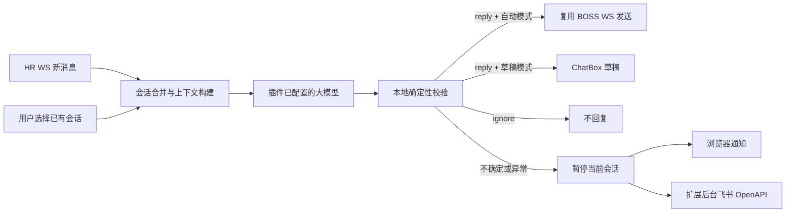

# AI 自动回复与飞书通知设计

> 状态：MVP 已编码，待人工验证 
> 更新日期：2026-08-11

## 架构

Hermes 已从架构中移除。模型调用发生在插件现有 AI 层；BOSS 发送发生在现有 `GeekChatClientManager`；飞书只负责人工接管通知。

## 确定性边界

提示词只接收岗位信息、当前可见消息和已确认知识，并返回结构化决策。插件维护本轮可用证据 ID 集合，在模型返回后检查：动作是否合法、回复是否存在、字数是否超限、每个证据是否真实存在。任何回复没有有效证据时都直接转人工。

模型错误、无效 JSON、未知证据、JD/会话信息不足或 WS 发送条件缺失，都不会降级为“尝试回复”。系统持久化暂停该会话，并等待用户在 ChatBox 点击恢复。

## 飞书边界

App ID、App Secret、接收类型和接收 ID 只能在扩展自身域名的 Options 页面输入，并存入 `storage.local` 的独立配置；BOSS 页面只读取“已配置/未配置”状态。App Secret 不进入可导出的 BossHelper 普通配置、AI 提示词或 BOSS 消息。后台用应用身份换取 `tenant_access_token`，缓存有效 Token，再以机器人身份发送文本。

通知只包含 HR、公司、岗位、最近消息、拒答原因和会话 ID。飞书失败不会触发 BOSS 回复；浏览器状态仍保留人工接管结果。

## 状态机

`ready → queued → generating → draft/sent/ignored` 为正常路径；`generating → awaiting_human/error → paused` 为失败关闭路径。用户可随时主动暂停；只有明确点击恢复才重新允许自动处理。
