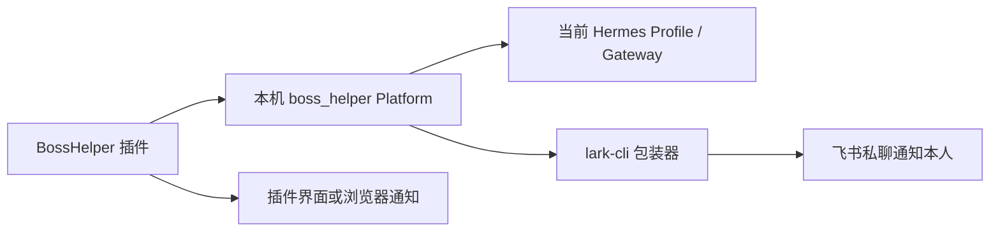

# AI 自动回复通知与 Hermes 集成设计

> 状态：部分确认
> 更新日期：2026-08-11
> 已确认范围：本机接入方式、Hermes Platform 方向和拒答通知链路。BossHelper 功能实现仍待讨论。

## 架构结论



采用 Hermes 自定义 Platform，而不是让“投递助手 Bot”和“Hermes Bot”在飞书群内互相传递消息。`boss_helper` Platform 位于 Hermes Gateway 内部，并向 BossHelper 提供本机接入能力，因此不再额外开发一个独立桥接服务。

## 组件职责

### BossHelper 插件

插件最终负责提供 BOSS 侧能力和本地通知。消息如何获取、何时调用 Hermes、谁执行最终发送等问题尚未设计，本文件不预设具体实现。

### `boss_helper` Platform

Platform 负责把 BossHelper 请求送入 Hermes，并把处理结果返回插件。未来决策层给出“拒答/升级”结果时，它还负责触发飞书通知。监听端口、接口路径、请求字段、认证方法、超时和会话规则均待后续确认。

### 当前 Hermes profile

复用当前 active profile 和已运行的 Gateway，不创建独立 `bossreply` profile，也不启动第二个 Hermes 实例。复用 profile 不等于让 BOSS 输入继承 Hermes CLI 的全部权限；具体 Platform 工具白名单和上下文隔离方式将在安全设计阶段确认。

### `lark-cli` 包装器

飞书通知通过固定的 `lark-cli` 命令执行，避免让模型自由拼接命令。计划使用的通知形态为：

```powershell
lark-cli im +messages-send --as bot --user-id <OWNER_OPEN_ID> --text <CONTENT> --idempotency-key <KEY>
```

Windows 实现应调用明确的 `lark-cli.cmd` 路径并传入参数数组，不通过 Shell 拼接 HR 原文。该方式复用现有飞书认证，但底层仍然使用飞书开放能力，不能绕过权限或配额。

## 拒答通知流程

1. 未来的决策层输出“拒答/需要本人处理”。
2. BossHelper 保存并展示本地通知，确保本人即使收不到飞书消息也能发现问题。
3. `boss_helper` Platform 生成结构化通知内容，并通过包装器调用 `lark-cli`。
4. 飞书 Bot 私聊本人，携带原因、岗位和必要的最近对话。
5. 飞书发送失败时记录失败，但绝不把失败降级为向 HR 自动回复。

## 已放弃或暂不采用的方案

- **飞书 Bot 群聊中转**：链路更长，消息关联、超时、权限和重复消费更复杂，不作为主通道。
- **单独桥接服务**：自定义 Platform 已能承担本机桥接职责，当前没有必要增加第三个常驻进程。
- **飞书 AI Assistant 代码生成环境**：其沙箱限制和计费能力与本机运行方案无关，本项目不依赖该环境。
- **赋予 Hermes 直接操作 BOSS 的最高权限**：不作为默认方案；最终发送边界需要在插件设计阶段单独确认。

## 安全原则与待定项

当前已确认最小权限、固定命令和失败关闭原则。以下内容仍需设计后才能落地：

- Platform 的本机监听协议与身份认证。
- Hermes 可见的工具、profile memory 和其他上下文范围。
- 飞书通知字段、脱敏要求、长度限制和幂等规则。
- 插件与 Platform 离线、超时或重启后的恢复方式。
- 飞书 Base 是否作为知识来源，以及查询身份和权限边界。
