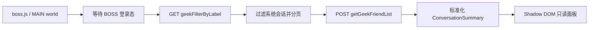

# BOSS 聊天会话列表 MVP 设计

> 状态：已完成，真实账号验收通过
> 更新日期：2026-08-11
> 阶段目标：只读获取已沟通 HR 的会话列表，并在 BOSS 聊天页可见地展示。

## 目标与验收标准

本阶段只验证 BossHelper 能否稳定获得当前账号的 HR 会话列表，为后续新消息监听、上下文收集和 AI 决策提供数据入口。

打开并刷新 `https://www.zhipin.com/web/geek/chat` 后，应出现独立的“BossHelper 聊天 MVP”面板。满足以下条件即验收通过：

- 面板显示本次读取状态和已聊 HR 总数。
- 首屏最多展示 100 个会话，包含 HR 名称、公司或岗位、最近一条消息和时间；缺失字段使用明确占位，不猜测内容。
- 刷新按钮只触发一次人工请求；没有轮询、自动翻页或后台批量抓取。
- 读取失败时显示中文错误，不发送任何 BOSS 消息，也不调用 Hermes 或飞书。

“消息列表”在本阶段指会话列表及每个会话的最近一条消息，不包含完整聊天历史。

## 数据流

插件复用仓库内 `geek-chat-sdk v2.0.4` 已使用的两个接口，但 MVP 不加载该 885 KB UMD 文件，也不创建新的 MQTT/WebSocket 连接：

- `GET /wapi/zprelation/friend/geekFilterByLabel?labelId=0`：取得已沟通关系索引。
- `POST /wapi/zprelation/friend/getGeekFriendList.json`：批量补全 HR、岗位和最近消息信息。

请求在 BOSS 页面 MAIN world 中执行，使用当前页面 Cookie 中的 `bst` 作为 `Zp_token`，并携带同站 Cookie。令牌不写入日志、扩展存储或页面节点。

## 模块设计

- `src/entrypoints/boss/chat/conversation-list.ts`：接口调用、分页、系统会话过滤和标准化。
- `src/entrypoints/boss/chat/mvp-panel.ts`：等待页面可挂载、渲染加载/成功/失败状态、处理人工刷新。
- `src/entrypoints/boss/index.ts`：识别 `/web/geek/chat`，直接启动只读 MVP；岗位页面继续走原有流程。

标准化结果以 `${friendId}-${friendSource}` 作为会话键。接口字段缺失时保留空值，不从其他字段推断身份或消息内容。

## 安全与风险控制

- 仅使用当前用户已登录会话，不尝试绕过验证码、登录或访问控制。
- 首次进入自动读取一次，之后仅允许人工刷新；请求超时后失败关闭。
- 排除 BOSS 聊天机器人、求职助手等非 HR 会话。
- 数据仅保存在页面内存和 Shadow DOM 中；本阶段不持久化、不转发。
- 私有接口可能随 BOSS 更新而变化。响应解析必须容忍新增字段，并对缺少关键结构给出错误。

## 后续阶段

第二步尚未确定。候选方向包括监听标准化 `message` 事件、补齐完整聊天上下文或先完善插件交互；需讨论确认后再设计和开发。AI、Hermes、拒答通知和自动发送均不属于本 MVP。

## 当前实现与验证记录

- 已实现会话索引读取、HR/系统会话过滤、首屏分页、详情补全和标准化。
- 已实现聊天页 Shadow DOM 面板、加载/成功/失败状态、人工刷新和收起功能。
- 模拟接口验证通过：能够正确过滤求职助手与聊天机器人，分别组装普通好友和直聊好友参数，并按最近消息时间排序。
- 新增 TypeScript 文件通过 `oxfmt` 和 `oxlint`；直接 `tsc` 检查未发现指向新增文件的错误。
- 真实账号验收通过：Chrome 加载构建产物后，聊天页成功显示 1 条已聊 HR 会话，名称、公司/职位、最近消息和时间均正常展示。
- 面板保持只读，页面明确提示最多读取 100 条且不会自动发送消息。
