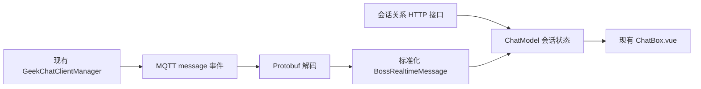

# BOSS WS 消息接收 MVP 设计

> 状态：代码完成，待人工验证
> 更新日期：2026-08-11
> 阶段目标：岗位页自动载入会话摘要，复用现有聊天连接接收并解析新文本消息，在当前 ChatBox 中只读展示。

## 已确认方案

插件不创建第二条 WebSocket/MQTT 连接。`BossHelperCtx.geek` 继续负责现有消息发送，同时在同一个 MQTT 客户端上监听 `message` 事件；收到二进制载荷后，使用仓库现有 `ProtoBufferMessage.decode()` 解码。

连接成功后按仓库内 BOSS SDK 的方式发送 presence 握手。该握手仍通过同一个 `chat` topic，不向 HR 产生聊天消息。

## 消息标准化

标准消息至少包含：消息 ID、会话 ID、对方用户 ID/来源、对方名称与头像、收发方向、内容类型、文本、时间和离线标记。

- 使用 `mid`，缺失时使用 `cmid`，并在内存中去重。
- 根据当前登录用户 ID 区分 `incoming`、`outgoing` 和 `system`。
- MVP 只向 ChatBox 写入与当前用户相关的非离线文本消息。
- 图片、卡片、系统事件和无法识别的消息只记录类型，不记录正文，也不触发回复。

## ChatBox 复用

在现有 `ChatModel` 中增加外部会话元数据、运行状态和追加消息入口。进入岗位页后自动读取一次已聊 HR 会话摘要，作为 ChatBox 初始标签和最近一条消息；后续 WS 消息直接追加。BOSS 会话使用独立键，避免与岗位 AI 会话冲突；ChatBox 显示连接、重连和摘要读取状态，输入区显示“只读”提示，不提供发送动作。

MQTT 的 `close`、`offline` 和 `reconnect` 都属于自动重连过程，不直接显示为永久断开。连接连续稳定 2 秒后才显示“WS 已连接”；短暂中断统一显示为黄色重连状态，避免界面在红色断开与绿色连接之间快速跳变。

第一阶段的独立聊天列表面板暂时保留作为诊断工具。待本阶段真实验收后，再决定删除或改成调试开关。

## 验收标准

- 岗位页主界面只建立原有的一条聊天 WS。
- 打开岗位页后自动显示会话摘要，无需进入聊天页或点击刷新。
- HR 新发一条文本消息后，无需刷新即可收到并完成 Protobuf 解析。
- 同一 `mid` 只展示一次，且能区分 HR 消息与本人消息。
- 打开当前 ChatBox 后能看到对应 HR 会话和原始文本。
- 全程不调用 AI、Hermes 或飞书，不自动向 BOSS 发送回复，不持久化聊天正文。

## 当前限制

- 接收器目前随岗位页的 BossHelper 主界面启动；跨页面常驻尚未设计。
- 初始内容只是关系接口返回的最近一条消息，不是完整聊天历史。
- 不处理图片、附件、卡片或撤回事件，也尚未调用 Hermes。
- WS 私有协议可能变化，解码失败时必须记录中文错误并停止处理该载荷。
